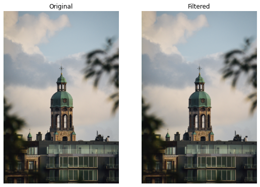
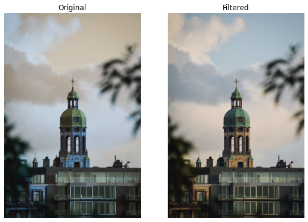
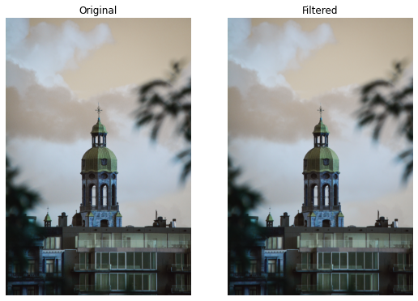
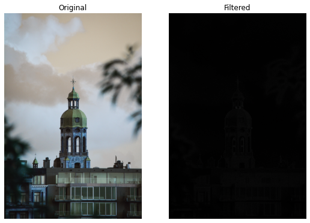
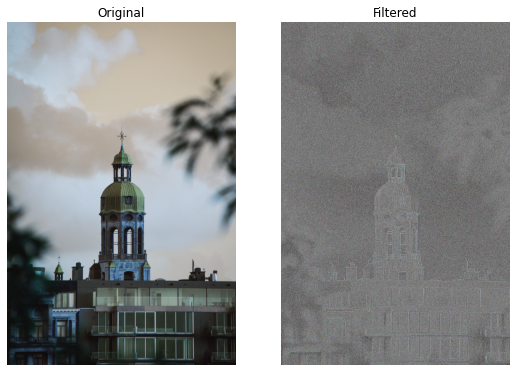

# Implementation-of-Filters
## Aim:
To implement filters for smoothing and sharpening the images in the spatial domain.

## Software Required:
Anaconda - Python 3.7

## Algorithm:
### Step1

Import libraries and read the saved images using cv2.imread().

### Step2

Convert the saved BGR image to RGB using cvtColor().

### Step3

By using the following filters for image smoothing:filter2D(src, ddepth, kernel), Box filter,Weighted Average filter,GaussianBlur(src, ksize, sigmaX[, dst[, sigmaY[, borderType]]]), medianBlur(src, ksize),and for image sharpening:Laplacian Kernel,Laplacian Operator.

### Step4

Apply the filters using cv2.filter2D() for each respective filters.

### Step5

Plot the images of the original one and the filtered one using plt.figure() and cv2.imshow().
## Program:
```Python
# Developed By   : Kadin Samson L
# Register Number: 212221230044
```
</br>

# 1. Smoothing Filters
```Python

import cv2
import matplotlib.pyplot as plt
import numpy as np
#i) Using Averaging Filter

image1=cv2.imread("image.jpg")
image2=cv2.cvtColor(image1,cv2.COLOR_BGR2RGB)
kernel=np.ones((11,11),np.float32)/121

avg_filter = cv2.filter2D(image2,-1,kernel)
plt.figure(figsize = (9,9))
plt.subplot(1,2,1)
plt.imshow(image2)
plt.title("Original")
plt.axis("off")
plt.subplot(1,2,2)
plt.imshow(avg_filter)
plt.title("Filtered")
plt.axis("off")


#ii) Using Weighted Averaging Filter

kernel2 = np.array([[1,2,1],[2,4,2],[1,2,1]])/16
weighted_filter = cv2.filter2D(image1,-1,kernel2)
plt.figure(figsize = (9,9))
plt.subplot(1,2,1)
plt.imshow(image1)
plt.title("Original")
plt.axis("off")
plt.subplot(1,2,2)
plt.imshow(weighted_filter)
plt.title("Filtered")
plt.axis("off")

#iii) Using Gaussian Filter

gaussian_blur = cv2.GaussianBlur(src = image1, ksize = (11,11), sigmaX=0, sigmaY=0)
plt.figure(figsize = (9,9))
plt.subplot(1,2,1)
plt.imshow(image1)
plt.title("Original")
plt.axis("off")
plt.subplot(1,2,2)
plt.imshow(gaussian_blur)
plt.title("Filtered")
plt.axis("off")


#iv) Using Median Filter

median = cv2.medianBlur(src=image1,ksize = 11)
plt.figure(figsize = (9,9))
plt.subplot(1,2,1)
plt.imshow(image1)
plt.title("Original")
plt.axis("off")
plt.subplot(1,2,2)
plt.imshow(median)
plt.title("Filtered")
plt.axis("off")
```


# 2. Sharpening Filters
```python
i) Using Laplacian Kernal

kernel3 = np.array([[0,1,0],[1,-4,1],[0,1,0]])
laplacian_kernel = cv2.filter2D(image1,-1,kernel3)
plt.figure(figsize = (9,9))
plt.subplot(1,2,1)
plt.imshow(image1)
plt.title("Original")
plt.axis("off")
plt.subplot(1,2,2)
plt.imshow(laplacian_kernel)
plt.title("Filtered")
plt.axis("off")

ii) Using Laplacian Operator

laplacian_operator = cv2.Laplacian(image1,cv2.CV_64F)
plt.figure(figsize = (9,9))
plt.subplot(1,2,1)
plt.imshow(image1)
plt.title("Original")
plt.axis("off")
plt.subplot(1,2,2)
plt.imshow(laplacian_operator)
plt.title("Filtered")
plt.axis("off")
```

## OUTPUT:
### 1. Smoothing Filters
</br>

i) Using Averaging Filter


ii) Using Weighted Averaging Filter


iii) Using Gaussian Filter


iv) Using Median Filter


### 2. Sharpening Filters
</br>

i) Using Laplacian Kernal


ii) Using Laplacian Operator



## Result:
Thus the filters are designed for smoothing and sharpening the images in the spatial domain.
